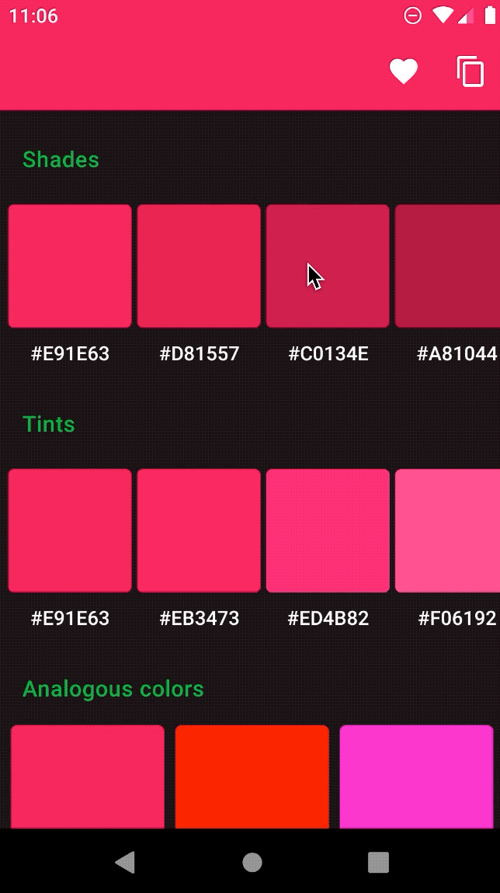
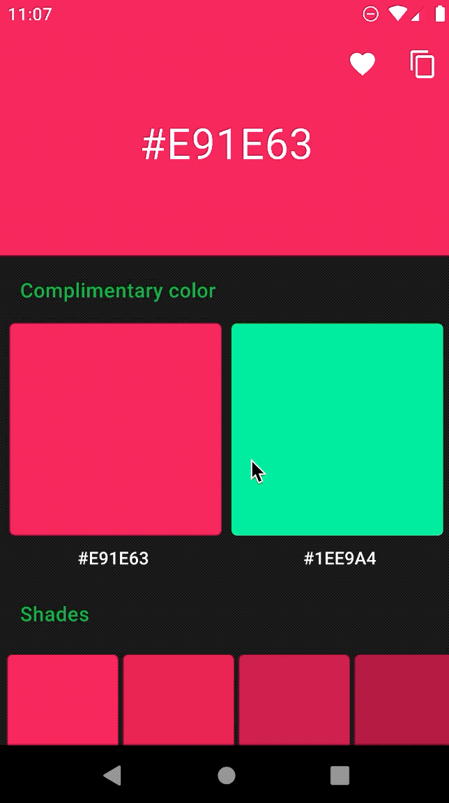

AndroidColorX [](https://circleci.com/gh/JorgeCastilloPrz/AndroidColorX/tree/master)
======

AndroidColorX (i.e: Android Color Extensions) is an Android library written in Kotlin that provides color utilities as [Kotlin extension functions](https://kotlinlang.org/docs/tutorials/kotlin-for-py/extension-functionsproperties.html). The library relies on AndroidX [`ColorUtils`](https://developer.android.com/reference/kotlin/androidx/core/graphics/ColorUtils) for some of its calculations.


### Color conversion

This library provides seamless conversion between the following color types:

* `android.graphics.Color (ColorInt)`
* `RGBColor`
* `ARGBColor`
* `HEXColor`
* `HSLColor`
* `CMYKColor`

To convert a color type to any of the other types, you can use the extensions provided for it.

```kotlin
val color = Color.parseColor("#e91e63")

val rgb = color.asRgb()
val argb = color.asArgb()
val hex = color.asHex()
val hsl = color.asHsl()
val cmyk = color.asCmyk()

val colorHsl = HSLColor(hue = 210, saturation = 0.5, lightness = 0.5)

val colorInt = colorHsl.asColorInt()
val rgb = colorHsl.asRgb()
val argb = colorHsl.asArgb()
val hex = colorHsl.asHex()
val cmyk = colorHsl.asCmyk()
```

The same extensions **are available for all the mentioned color types**.

### Shades and tints

If you're aware of webs like [Color-Hex](https://www.color-hex.com/color/6dc066) you've probably seen those shades and tints palettes. AndroidColorX provides extensions for calculating those:



Here's the code for all the color types available:

```kotlin

val color = Color.parseColor("#e91e63")

// shades
val shades: List<Int> = color.getShades()
val shadesHsl: List<HSLColor> = color.asHsl().getShades()
val shadesCmyk: List<CMYKColor> = color.asCmyk().getShades()
val shadesHex: List<HEXColor> = color.asHex().getShades()
val shadesRgb: List<RGBColor> = color.asRgb().getShades()
val shadesArgb: List<ARGBColor> = color.asArgb().getShades()

// tints
val tints: List<Int> = color.getTints()
val tintsHsl: List<HSLColor> = color.asHsl().getTints()
val tintsCmyk: List<CMYKColor> = color.asCmyk().getTints()
val tintsHex: List<HEXColor> = color.asHex().getTints()
val tintsRgb: List<RGBColor> = color.asRgb().getTints()
val tintsArgb: List<ARGBColor> = color.asArgb().getTints()
```

As you can see, these extensions **are available for all the mentioned color types**.

### Complimentary, triadic, tetradic and analogous colors

The library provides extensions to calculate all those. There is a brief but very useful [post to understand all those here](https://www.tigercolor.com/color-lab/color-theory/color-harmonies.htm).



```kotlin
val color = Color.parseColor("#e91e63")

// Returns the complimentary color to the given one.
val complimentary: Int = color.complimentary()

// Returns the other 2 colors to complete the triadic color scheme.
val triadic: Pair<Int, Int> = color.triadic()

// Returns the other 3 colors to complete the tetradic color scheme.
val tetradic: Triple<Int, Int, Int> = color.tetradic()

// Returns the other 2 colors to complete the analogous color scheme.
val analogous: Pair<Int, Int> = color.analogous()
```

Once again, you've got those extensions available for all the color types in the library.

### Darken / Lighten a color

You can darken or lighten a color by an amount:

```kotlin
val color = Color.parseColor("#e91e63")

// Int in the 0...100 range. Anything else is clamped to 0...100
val darkerColor = color.darken(50)
val lighterColor = color.lighten(50)

// Float in the 0...1 range. Anything else is clamped to 0...1
val darkerColor = color.darken(0.5)
val lighterColor = color.lighten(0.5)
```

You can use this extensions over any color type available.

### Other interesting extensions

#### isDark

You can use this one to detect whether a color is considered "dark" or not. It delegates in the following AndroidX `ColorUtils` code `ColorUtils.calculateLuminance(this) < 0.5`. This is frequently used for inferring which color you should tint an icon or a text with, so it can have a good contrast on top of the underlying background.

```kotlin
val color = Color.parseColor("#e91e63")
icon.setDrawable = if (bgColor.isDark()) {
    R.drawable.ic_fav_light
} else {
    R.drawable.ic_fav_dark
}
```

License
-------

    Copyright 2019 Jorge Castillo Pérez

    Licensed under the Apache License, Version 2.0 (the "License");
    you may not use this file except in compliance with the License.
    You may obtain a copy of the License at

       http://www.apache.org/licenses/LICENSE-2.0

    Unless required by applicable law or agreed to in writing, software
    distributed under the License is distributed on an "AS IS" BASIS,
    WITHOUT WARRANTIES OR CONDITIONS OF ANY KIND, either express or implied.
    See the License for the specific language governing permissions and
    limitations under the License.


